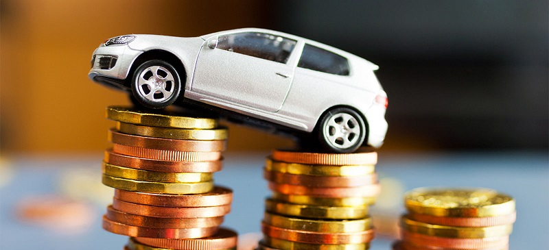

## Предсказание стоимости автомобилей

### Что было сделано

Мы получили данные о параметрах и стоимости автомобилей. Нашей задачей было научиться предсказывать стоимость автомобиля по его параметрам.

Данные были предварительно разбиты на тренировочную и тестовую выборки.

Нами были выполнены следующие шаги:
- проанализированы имеющиеся признаки: с помощью визуализации/кода;
- найдены и заменены пропущенные значения;
- найдены выбросы, сделана попытка удалить некоторые из них;
- преобразованы все категориальные признаки;
- на основе имеющихся созданы новые/преобразованы существующие признаки;
- построено несколько моделей: с разным составом признаков, с масштабированием и без, с регуляризацией и без;
- выбрана лучшая модель, посчитана бизнес-метрика;
- реализован сервис на fast-api для предсказания стоимости автомобилей;

### С какими результатами

Реализована модель линейной регрессии с l2-регуляризацией.

Выполнен [анализ данных, сравнение моделей и подбор параметров](HW1_Regression_with_inference.ipynb)

Параметры модели, веса признаков и прочие данные, необходимые для предсказания цены на новых данных, сохранены в [отдельном файле](model.pkl).

Реализован [сервис](main.py) для получения предсказаний по данным одного/нескольких автомобилей.

Метрику $R^2$ удалось улучшить с 0.595 до 0.796 на тесте. Однако бизнес-метрика оказалась невысокой.

### Что дало наибольший буст в качестве

Наиболее полезным для модели стало использование категориальных переменных, а также добавление новых признаков. Например, признак `brand`, характеризующий компанию, выпускающую конкретный автомобиль, повлиял на увеличение метрики.

### Что сделать не вышло и почему

Не удалось улучшить модель с помощью масштабирования и l1-регуляризации.

С помощью `GridSearch` не удалось подобрать параметры для l1-регуляризации, которые бы показали лучший эффект, чем параметры по умолчанию. Вероятно, это связано с тем, что `GridSearch` работает по определенной сетке, и с тем, что параметры модели по умолчанию в определенных случаях уже являются оптимальными.

Не удалось улучшить модель с помощью удаления выбросов, т.к., видимо, тестовые данные тоже не идеальны, и после удаления выбросов модель переобучалась.